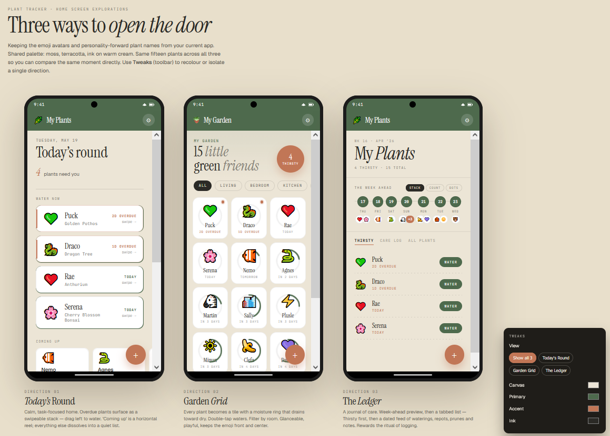

<header class="ae-head">
<h1 class="ae-title">Building the <em>App</em></h1>

A reflection on my thought process — and the steps I took — building the Plant Tracker app, with Claude as a partner throughout.

By Anne Elefante · 5 min read · 2026

</header>

<nav class="ae-index">

Contents

<ol>
<li><a href="#concept">The concept</a>§ I</li>
<li><a href="#build">The build</a>§ II</li>
<li><a href="#tending">The tending</a>§ III</li>
</ol>
</nav>

<section class="ae-sec">

<h2 id="concept">§ IThe concept</h2>

I didn't set out to make an app with AI. I had a problem: I couldn't remember each of my plant's watering schedules and their individual histories. I also couldn't find a tool that would allow me to easily do <em>only</em> what I wanted without so much bloat in the way of extra features.

<figure class="ae-fig ae-fig-wide">

<figcaption>Fig. 1 The plant corner — the problem I set out to solve.</figcaption>
</figure>

I was already using AI heavily in a variety of creative projects, so I worked with Claude to solve my problem:

<ul>
<li>I want to be able to remember when was the last time that I watered a plant</li>
<li>What did my plant look like last week? Two weeks ago? Last month? Is its condition actually improving?</li>
</ul>

This resulted in an app in which I could log notes for each plant. Claude also took it a step further by suggesting that instead of <em>only</em> tracking when a plant was last watered, the app could surface a reminder for when a plant needs to be watered. I had been thinking small in the sense that I only wanted to solve a problem whereas Claude's suggestion meant that I was changing my actual workflow.

From there, I worked with Claude to flesh out the app design with the following requirements:

<ul>
<li>This must be mobile-friendly</li>
<li>There must be a way to export and import data for posterity</li>
<li>Recording waterings should be as simple as tapping just <em>one</em> button</li>
<li>The aesthetic must feel warm and cozy while also being efficient</li>
</ul>

With these in mind, Claude drafted a handover document with specifications regarding the purpose, design, and technical needs for the Plant Tracker. It was time to switch to Claude Code to build the actual app.

</section>

<section class="ae-sec">

<h2 id="build">§ IIThe build</h2>

Working with Claude Code was the biggest learning curve for me and that continues even to this day. I have no experience with developing an app but I have been in the tech industry for 10 years and I have worked with a product team closely enough to have a rough idea of operations. More importantly, my work in support means that I have experience collaborating with product managers and product designers when it comes to defining, refining, and communicating an app's intended user experience.

All of that taught me that while Claude could handle the execution, my role was to manage the direction. Of course I already held this truth in the previous stage when I was conceptualizing the app with Claude. Naming this understanding at this point of development was integral though since I was entering a phase in which I had less control than before.

<aside class="ae-note">
1
The number of times that I had to ask Claude Code how to actually deploy changes and merge a pull request through Github…
</aside>

I had to get used to the Claude Code desktop app and terminal UI, create a Github account, and create a Vercel account.1 I had to be honest with myself about my lack of familiarity in this domain and also be comfortable enough to ask questions that made me <em>feel</em> that lack. I had to be conscientious about what gaps AI was filling for me in order to be efficient and intentional about my project and the scope of my part in it.

On the other hand, actually talking through what I wanted for the Plant Tracker was simple: from its purpose, the functionality that I wanted for watering data, and the flow for adding notes was something that I felt confident in conveying.

Once I was able to add plants and press a button to say that they had been watered, the app went live.

</section>

<figure class="ae-pull">
<blockquote>I'm learning to not limit myself to what <em>I</em> can do and instead allow my collaboration with AI to push my projects further than I could do on my own.</blockquote>
</figure>

<section class="ae-sec">

<h2 id="tending">§ IIIThe tending</h2>

From thereon, I started noting down the features that I wanted to implement in the future:

<ul>
<li>adding general notes — with emojis for easy scanning at-a-glance</li>
<li>uploading photos</li>
<li>adjusting watering schedules</li>
<li>displaying the actual watering cadence</li>
</ul>

I worked incrementally and throughout it all, I ensured that each new feature continued to address the app's main purpose: tracking how I have been caring for my plants. My experience working in tech taught me how easy it is to allow scope creep and I was determined to keep Plant Tracker lightweight and focused.

<aside class="ae-note">
2
I opted for <em>The Ledger</em> design since it actually brought a new functionality by surfacing a view of waterings for the week ahead.
</aside>

During the early days of the build, Claude Design was released. I used it to design a dashboard for the app as a way of learning this new tool. It produced three different concepts for the dashboard.2

<figure class="ae-fig">

<figcaption>Fig. 2 Claude Design's three dashboard concepts. I chose The Ledger.</figcaption>
</figure>

I also brought in expertise from friends to refine the app even further:

<ul>
<li>a business intelligence engineer suggested that the watering cadence chart track the number of days in between waterings instead of the number of times a plant was watered</li>
<li>a software engineer audited my github repo for security gaps despite all of the data being stored locally</li>
<li>my plant enthusiast friends used the app and tested the workflow to offer suggestions for change and potential future additions</li>
</ul>

Plant Tracker has become a learning journey that has gone beyond "I need to track my plants". The project itself has been me asking "What can I do with AI?" It's been a pleasure and I'm learning to not limit myself to what <em>I</em> can do and instead allow my collaboration with AI to push my projects further than I could do on my own.

And hey, I'm getting more plants. Surely that means I'm going to keep developing the app 😉

</section>

