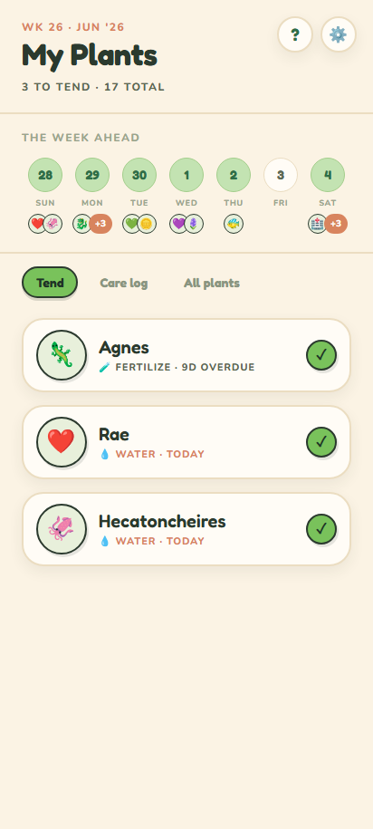
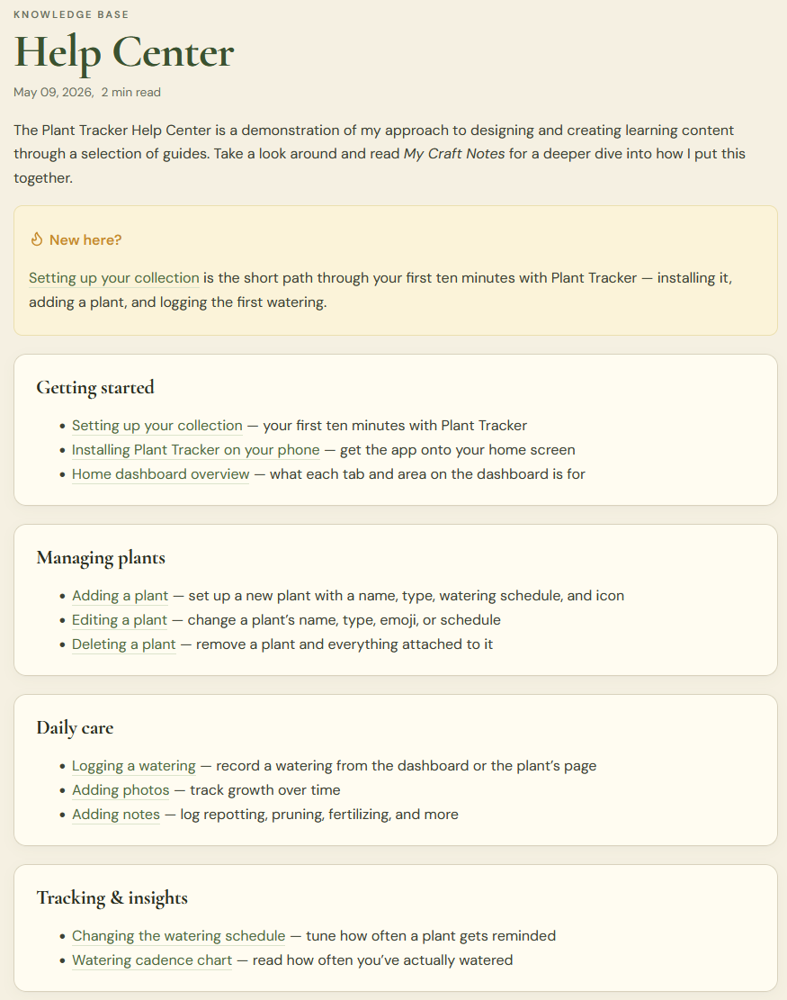
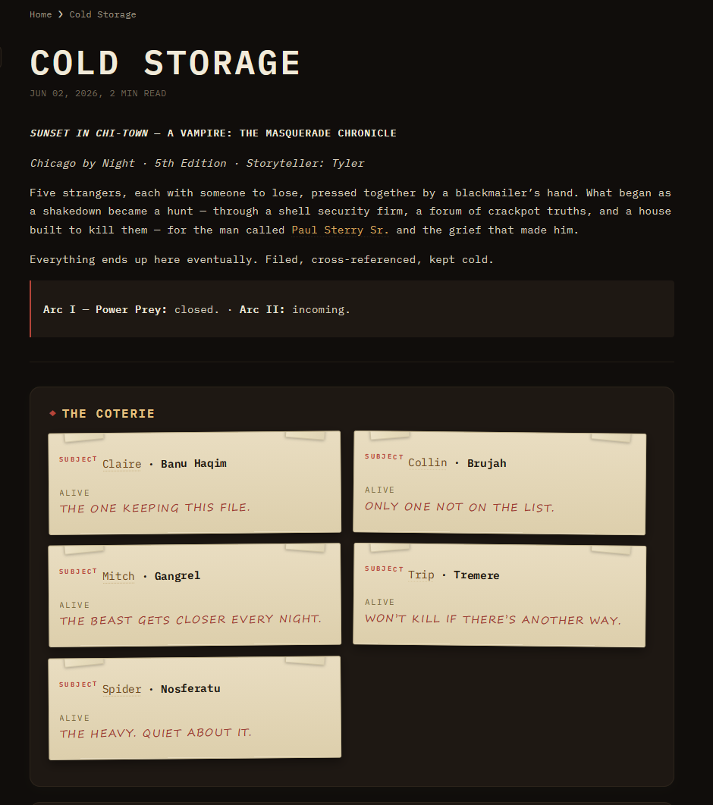

<nav class="hp-nav">
<a class="hp-brand" href="/">The VFP</a>

<a href="#about">About</a>
<a href="#whatido">What I do</a>
<a href="#projects">Projects</a>
<a href="#background">Background</a>
<a href="#contact">Contact</a>

<a class="hp-btn hp-btn-primary hp-nav-resume" href="/resume.pdf" target="_blank" rel="noopener">Résumé ↗</a>
</nav>

<header class="hp-hero" id="about">

<h1 class="hp-name">Anne Elefante</h1>

Knowledge &amp; Support Specialist

I build the things people reach for when they're stuck.

Good answers fail all the time — buried in a help centre, written for the wrong audience, arriving three steps too late. I build knowledge systems that show up for people when they need them.

<a class="hp-btn hp-btn-primary" href="/resume.pdf" target="_blank" rel="noopener">Résumé ↗</a>
<a class="hp-btn" href="https://www.linkedin.com/in/christianne-elefante-598203137" target="_blank" rel="noopener">LinkedIn ↗</a>

</header>

<section class="hp-section" id="whatido">

Capabilities

<h2 class="hp-section-title">What I do</h2>

01

Make it make sense

Help centres, onboarding, and instructional content written for humans.

02

Make it easy to find

Information architecture, taxonomy, and knowledge base design so nobody has to ask twice.

03

Make it better

Support operations and voice-of-customer loops, so the answers improve every time someone asks.

</section>

<section class="hp-section" id="projects">

Selected work

<h2 class="hp-section-title">Projects</h2>

<article class="hp-proj">

01 · Plant Tracker

<h3 class="hp-proj-title">Plant Tracker</h3>

A houseplant care app, built by directing AI

I had 19 houseplants and no system. So I took a product idea from concept to live app: I set the scope, made the design calls, and directed Claude Code through implementation. It's been in daily use ever since, tracking watering schedules for a real plant collection.

<a class="hp-btn hp-btn-primary" href="https://plant-tracker-blue.vercel.app" target="_blank" rel="noopener">Try it ↗</a>
<a class="hp-btn" href="Plant-Tracker/Project-Journey/Building-the-App">How I built it →</a>

</article>

<article class="hp-proj">

02 · Help Center

<h3 class="hp-proj-title">Plant Tracker Help Center</h3>

The knowledge layer for the app above

Then I built its help centre partly as documentation and partly as a scalability experiment: how do you produce 10+ articles without quality drifting? My answer was governance-first. I wrote three seed articles, bootstrapped a style guide from them, then directed AI to generate the rest under those standards.

<a class="hp-btn hp-btn-primary" href="Plant-Tracker/Help-Center/index">Read it →</a>
<!-- TODO: add "How I built it →" → Plant-Tracker/Project-Journey/Creating-the-Help-Center once that reflection is written (currently draft) -->

</article>

<article class="hp-proj">

03 · Cold Storage

<h3 class="hp-proj-title">Cold Storage</h3>

A campaign wiki built from primary sources

A wiki for a Vampire: The Masquerade chronicle — and a workflow experiment. I recorded our game sessions, then used the auto-generated captions as source material for AI-drafted documentation. The question I wanted to answer was “can you go from primary source to structured, cross-referenced knowledge without writing every word by hand?”

<a class="hp-btn hp-btn-primary" href="Cold-Storage/index">Read it →</a>
<!-- TODO: add "How I built it →" once the Cold Storage reflection is written -->

</article>

</section>

<section class="hp-section" id="background">

Work + school

<h2 class="hp-section-title">Background</h2>

Decisive Farming / TELUS Agriculture AgTech

Customer Experience Manager II — sole owner of customer support for a B2B agronomy platform; built the help centre, onboarding program, and voice-of-customer loop.

2021 — 2026

Showbie EdTech · Edmonton

First dedicated support hire — built the support function, help library, and educator onboarding from scratch, then returned across multiple roles while completing two degrees.

2016 — 2021

MLIS University of Alberta

Master of Library and Information Studies. ALA Spectrum Scholar.

2021

B.Ed (Secondary) University of Alberta

English major, Communication Design minor. With distinction.

2019

</section>

<footer class="hp-footer" id="contact">

© 2026 Anne Elefante · Built with Quartz

<a href="https://www.linkedin.com/in/christianne-elefante-598203137" target="_blank" rel="noopener">LinkedIn ↗</a>

</footer>
