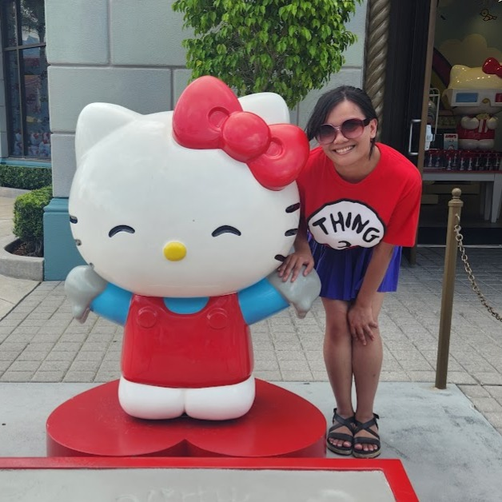

<nav class="hp-nav">
<a class="hp-brand" href="/"><svg class="hp-brand-elephant" width="22" height="22" viewBox="0 0 64 64" fill="none" aria-hidden="true"><g fill="none" stroke="var(--gp-sage-deep)" stroke-width="2.6" stroke-linecap="round" stroke-linejoin="round"><path d="M36 14 C 26 11 17 17 18 27 C 18 34 16 41 19 45 C 22 50 27 47 25 42"/><path d="M36 14 C 39 14 40 15 41 16 C 54 13 58 29 49 37 C 45 39 42 37 41 32 C 39 34 37 38 34 38"/></g><circle cx="24" cy="28" r="1.5" fill="var(--gp-sage-deep)"/></svg>Anne Elefante</a>

<a href="#about">About</a>
<a href="#whatido">What I do</a>
<a href="#projects">Projects</a>
<a href="#background">Background</a>

<a class="hp-btn hp-btn-primary hp-nav-resume" href="/resume.pdf" target="_blank" rel="noopener">Résumé ↗</a>
</nav>

<header class="hp-hero" id="top">

Knowledge &amp; Support Specialist

<h1 class="hp-name">Anne Elefante</h1>

I build the things people reach for when they're stuck.

Good answers fail all the time — buried in a help centre, written for the wrong audience, arriving three steps too late. I build knowledge systems that show up for people when they need them.

<a class="hp-btn hp-btn-primary" href="/resume.pdf" target="_blank" rel="noopener">Résumé ↗</a>
<a class="hp-btn" href="https://www.linkedin.com/in/christianne-elefante" target="_blank" rel="noopener">LinkedIn ↗</a>

</header>

<section class="hp-section" id="whatido">

<h2 class="hp-section-title">What I do</h2>

Make it make sense

Help centres, onboarding, and instructional content written for humans.

Make it easy to find

Information architecture, taxonomy, and knowledge base design so nobody has to ask twice.

Make it better

Support operations and voice-of-customer loops, so the answers improve every time someone asks.

</section>

<section class="hp-section" id="projects">

<h2 class="hp-section-title">Projects</h2>

<article class="hp-proj">

<h3 class="hp-proj-title">Plant Tracker</h3>

I had 19 houseplants and no system. So I took a product idea from concept to live app: I set the scope, made the design calls, and directed Claude Code through implementation. It's been in daily use ever since, tracking watering schedules for a real plant collection.

<a class="hp-btn hp-btn-primary" href="https://plant-tracker-blue.vercel.app" target="_blank" rel="noopener">Try it ↗</a>
<a class="hp-btn" href="Building-the-App">How I built it →</a>

</article>

<article class="hp-proj">

<h3 class="hp-proj-title">Plant Tracker Help Center</h3>

Then I built its help centre partly as documentation and partly as a scalability experiment: how do you produce 10+ articles without quality drifting? My answer was governance-first. I wrote three seed articles, bootstrapped a style guide from them, then directed AI to generate the rest under those standards.

<a class="hp-btn hp-btn-primary" href="Help-Center/index">Read it →</a>
<!-- TODO: add "How I built it →" → Creating-the-Help-Center once that reflection is written (currently draft) -->

</article>

<article class="hp-proj">

<h3 class="hp-proj-title">Cold Storage</h3>

A wiki for a Vampire: The Masquerade chronicle — and a workflow experiment. I recorded our game sessions, then used the auto-generated captions as source material for AI-drafted documentation. The question I wanted to answer was “can you go from primary source to structured, cross-referenced knowledge without writing every word by hand?”

<a class="hp-btn hp-btn-primary" href="Cold-Storage/index">Read it →</a>
<!-- TODO: add "How I built it →" once the Cold Storage reflection is written -->

</article>

</section>

<section class="hp-section" id="background">

<h2 class="hp-section-title">Background</h2>

Decisive Farming / TELUS Agriculture AgTech

Customer Experience Manager II — sole owner of customer support for a B2B agronomy platform; built the help centre, onboarding program, and voice-of-customer loop.

2021 — 2026

Showbie EdTech · Edmonton

First dedicated support hire — built the support function, help library, and educator onboarding from scratch, then returned across multiple roles while completing two degrees.

2016 — 2021

MLIS University of Alberta

Master of Library and Information Studies. ALA Spectrum Scholar.

2021

B.Ed (Secondary) University of Alberta

English major, Communication Design minor. With distinction.

2019

</section>

<section class="hp-section" id="about">

<h2 class="hp-hi">Hi ✨</h2>

I'm an actual human being on the other side of the screen! I'm out here trying my best to take care of the nineteen plants I bought on a whim, I read epic fantasy doorstoppers, and I'd <em>like</em> to think that I'm a cozy gamer who loves farming games… but my nights as a raid lead in Final Fantasy XIV say otherwise.

When I'm not at my computer, catch me at a cute café with too much stationery spread out for journaling. If you see me out with my Hello Kitty grocery bags, the chances are high that I've stuffed them full of desserts, board games, or a very ill-advised book haul — sometimes there's actual groceries, too.

Thanks for stopping by!

</section>

<footer class="hp-footer" id="contact">

“The truth about stories is that that’s all we are.” — Thomas King

© 2026 Anne Elefante · Built with Quartz

<a href="https://www.linkedin.com/in/christianne-elefante" target="_blank" rel="noopener">LinkedIn ↗</a>

</footer>
